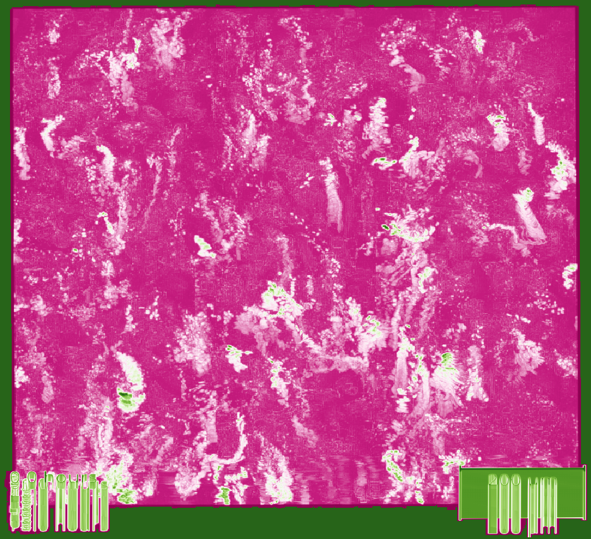

<!-- #region -->

# As of yet unannounced title.

### Abstract

Here goes some text that will the abstract of this paper...

### Introduction

And here goes the introduction...

### Methodology

The code for the paper will be linked here: [Notebooks](https://nthndy.github.io/macrohetest/tree/main/code)

### Results

Figure X: A title to show what figure X shows.

<iframe src="https://nthndy.github.io/macrohetest/interactive_plots/doubling_times.html" width="100%" height="800px" frameborder="0"></iframe>

### Discussion

Much insight

<!-- #endregion -->
